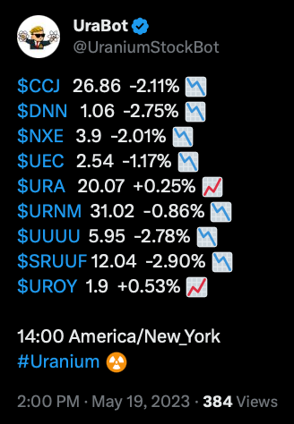
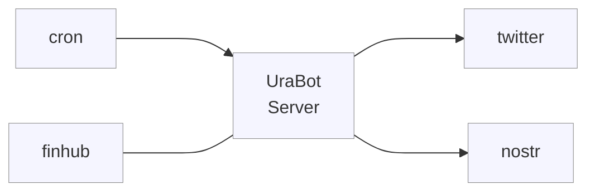

<p align="center">
  <!-- cover image -->
  
</p>

# UraBot

<p>
  <a href="https://railway.app/" target="_blank">
    
  </a>
  </a>
  <a href="https://codeclimate.com/github/victorabarros/ura-bot" target="_blank">
    
  </a>
  </a>
  <a href="https://cron-job.org/en/" target="_blank">
    
  </a>
  <a href="https://uptime.kuma.pet/" target="_blank">
    
  </a>
  <a href="https://nostr.com/" target="_blank">
    
  </a>
</p>

**[Twitter](https://twitter.com/UraniumStockBot)** and **[Nostr](https://snort.social/nprofile1qqsywtsnwnzf3syaahw559evnj6k0nlgdcm3kwsfyk39a7umx9mykmcdfu3ps)** page dedicated to sharing uranium market stock prices, analyses and relevant news.

<p align="center">
  <!-- Update screenshot with one more recent -->
  <a href="https://twitter.com/UraniumStockBot/status/1470423280712654850">
    
  </a>
</p>

## How to run

You can find all commands on [./Makefile](https://github.com/victorabarros/ura-bot/blob/main/Makefile)

write .env file similar to .env.example

```sh
# locally run with hot reload
make dev

# api requests
make healthcheck
make tweet-ura-stocks
make tweet-ura-news

# automated tests
make tests

# build and run production version
make build
make run
```

## Endpoint

|verb|endpoint|description|
|:-:|:-:|:-:|
|GET|/health|healthcheck|
|POST|/stocks/urabot|post Uranium market stocks price in real time|
|POST|/news/urabot|post Uranium market news|

## Flow



## Monitoring

To monitor the bot's server, it's using the [Uptime Kuma](https://uptime.kuma.pet/), a self-hosted monitoring tool.
It has integration with Telegram, so if a heartbeat fails it sends a message on telegram.

## Support

I'm more than happy to be honored with your support.

<p>
  <a href="https://www.buymeacoffee.com/victorbarros" target="_blank">
    
  </a>

  <a href="https://website.victorbarros.dev/wallet" target="_blank">
    
  </a>
</p>

<p align="center">
  <br/>
  Made in Brazil
  <br/>
  
</p>

<!--
TODO:
- more stocks https://twitter.com/FayeKnoozIV/status/1806373643435282575
- https://x.com/derekrogden/status/1797668427936731459
- references https://www.postman.com/twitter/workspace/twitter-s-public-workspace/request/9956214-c936778b-e343-4a23-b1b4-433c501cf6eb?ctx=code
- add welcome script https://github.com/victorabarros/CS50chain/blob/0e071b7af8851ef92791a1f068ed679f6da14ac4/Makefile#L11
- alternative to railway: https://render.com/
- weekly report on friday night or Monday morning / monthly report on last day of month / quarter report; example https://twitter.com/precodobitcoin/status/1480313562291658760
- add github actions => run tests on pr opened
- write article:
  - https://medium.com/p/152d197194/edit
  - part 1 - first auto tweet serveless with finhub and tweet
  - part 2 - cron and elephant sql (alternative to elephant is https://www.cockroachlabs.com/pricing/ or https://neon.tech/early-access/)
  - part 3 - add query params and cron with goodmorning/evenning.
- codecov https://app.codecov.io/gh/victorabarros/ura-bot
- data supplier alternative https://alpaca.markets/ | IEX https://cs50.harvard.edu/x/2022/psets/9/finance/#configuring
- is it possible to use a giphy api to add gif to news post? same to chart
-->
