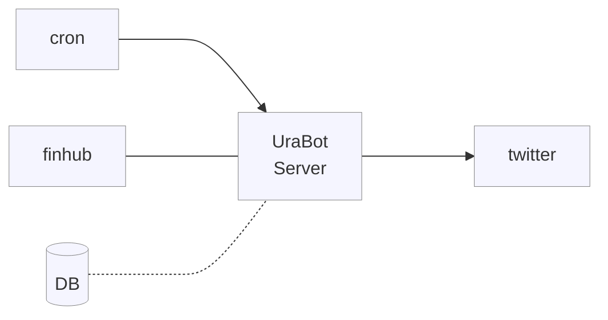

<p align="center">
  <!-- cover image -->
  
</p>

# UraBot

<p>
  <!-- badgets -->
  <a href="https://www.easycron.com/user">
    
  </a>
  <a href="https://dashboard.heroku.com/apps/ura-bot-server">
    
  </a>
  <a href="https://customer.elephantsql.com/">
    
  </a>
  <a href="https://codeclimate.com/github/victorabarros/ura-bot">
    
  </a>
</p>

Twitter page dedicated to sharing uranium market stock prices, analyses and relevant news.

<p align="center">
  <a href="https://twitter.com/UraniumStockBot/status/1470423280712654850">
    
    <!--  -->
  </a>
</p>

## How to run

You can find all commands on [./server/Makefile](https://github.com/victorabarros/ura-bot/blob/main/server/Makefile)

write .env file similar to .env.example

```sh
# locally run with hot reload
make dev

# test healthcheck and tweet endpoint
make healthcheck
make tweet

# automation tests
make tests

# build and run production version
make build
make run
```

## Endpoint

|verb|endpoint|description|
|:-:|:-:|:-:|
|GET|/health|healthcheck|
|POST|/tweet|tweet Uranium market stocks price in real time|

## Flow



<!--
```
Ladies and Gentlemen,
I introduce you to my new child:
twitter.com/uraniumStockBot
```

---

```
Dias atrás eu estava buscando aprender sobre a tese de uranio para investimentos, sob influência do @FernandoUlrich.
Pensando em fazer disto algo mais divertido, pensei como envolver programação na brincadeira.
Então que tive a ideia de desenvolver um bot que me atualiza com os preços em real-time das ações.
Daí que nasceu o UraBot. Escolhi a linguagem typescript, pois queria aperfeicoar-me e inclui bastante testes no projeto.
```

---

```
Hello Folks!

These last week I have been learning about Uranium investiments and looking for relevants pages about that to make me update with news.
As any developer passionate about automate any thing, I had this idea of developing a bot to update me with stock prices and news from uranium market. So,

Ladies and Gentlements,

I introduce you my new child:
UraBot

Also was a opportunity to improve my programming skills, so I choose typescript to learn more about and developed it with automation tests.
It was a very funny journey.
```

TODO:
  - add sponsoring https://www.google.com/search?channel=fs&client=ubuntu&q=how+add+sponsor+to+github+project
  - diminuir frequencia de tweet p de hora em hora
  - explicity the delta from percentage. to avoid this mistake https://twitter.com/the_growler_man/status/1485679069199048714
  - move good Morning and Good Evenning message to query param: curl -X POST ${URL}tweet?prefixMessage="GoodMorning"&posfixMessage="Good Evenning"
  - write article: part 1 - first auto tweet serveless with finhub and tweet; part2 - cron and elephant sql (alternative to elephant is heroku (akita has a video) or fly.io); part 3 - add query params and cron with goodmorning/evenning.
  - variation D-1 D-7 D-30 D-90 interaction => happy, money, sad, booom
  - add uranium/nuclear/energy icon 📉
  - improve body message (like https://twitter.com/DolarBipolar/status/1458801696017113093 https://twitter.com/precodobitcoin/status/1460951202531794951 https://twitter.com/precodobitcoin/status/1480313562291658760 https://twitter.com/hashdex/status/1481672773554610181 https://twitter.com/MercadoBitcoin/status/1493942572166832134 and add font/vendor)
  - tweet relevant news (understand what's better hour and schedule it)
- codecov https://app.codecov.io/gh/victorabarros/ura-bot
- CI
- integration tests - get QA credentials
- better https://github.com/FeedHive/twitter-api-client ?
- read https://www.infoq.com/news/2021/11/twitter-api-v2
-->
