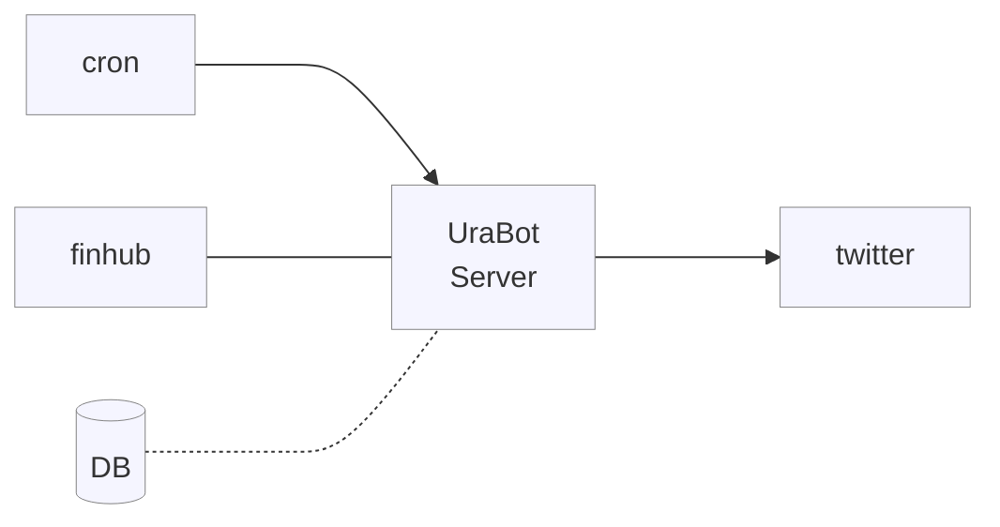

<p align="center">
  <!-- cover image -->
  
</p>

# UraBot

<p>
  <!-- badgets -->
  <!-- <a href="https://www.easycron.com/">
    
  </a> -->
  <!-- TODO add https://cron-job.org/en/ badgets -->
  <a href="https://railway.app/" target="_blank">
    
  </a>
  <a href="https://customer.elephantsql.com/" target="_blank">
    
  </a>
  <a href="https://codeclimate.com/github/victorabarros/ura-bot" target="_blank">
    
  </a>
</p>

Twitter page dedicated to sharing uranium market stock prices, analyses and relevant news.

<p align="center">
  <a href="https://twitter.com/UraniumStockBot/status/1470423280712654850">
    
    <!--  -->
  </a>
</p>

## How to run

You can find all commands on [./Makefile](https://github.com/victorabarros/ura-bot/blob/main/Makefile)

write .env file similar to .env.example

```sh
# locally run with hot reload
make dev

# test endpoints
make healthcheck
make tweet

# automation tests
make tests

# build and run production version
make build
make run
```

## Endpoint

|verb|endpoint|description|
|:-:|:-:|:-:|
|GET|/health|healthcheck|
|POST|/tweet|tweet Uranium market stocks price in real time|

## Flow



<p>
  <a href="https://www.buymeacoffee.com/victorbarros" target="_blank">
    
  </a>

  <a href="https://website.victorbarros.dev/wallet" target="_blank">
    
  </a>
</p>

<!--
TODO:
- improve body message (like https://twitter.com/DolarBipolar/status/1458801696017113093 https://twitter.com/precodobitcoin/status/1460951202531794951 https://twitter.com/precodobitcoin/status/1480313562291658760 https://twitter.com/hashdex/status/1481672773554610181 https://twitter.com/MercadoBitcoin/status/1493942572166832134 and add font/vendor)
- https://github.com/victorabarros/ura-bot/issues/2 =>  / weekly report on friday night or Monday morning / monthly report on last day of month / quarter report
- https://twitter.com/NuclearDorito/status/1503743597941862405 => include $U.U ( $U.UN / #SPUT)
- add github actions => run tests
- write article: part 1 - first auto tweet serveless with finhub and tweet; part2 - cron and elephant sql (alternative to elephant is https://www.cockroachlabs.com/pricing/ or https://neon.tech/early-access/); part 3 - add query params and cron with goodmorning/evenning.
- variation D-1 D-7 D-30 D-90 interaction => happy, money, sad, booom
- add uranium/nuclear/energy icon 📉
- tweet relevant news (understand what's better hour and schedule it)
- codecov https://app.codecov.io/gh/victorabarros/ura-bot
- integration tests - get QA credentials
- read https://www.infoq.com/news/2021/11/twitter-api-v2
- data supplier alternative https://alpaca.markets/ | IEX https://cs50.harvard.edu/x/2022/psets/9/finance/#configuring
-->
